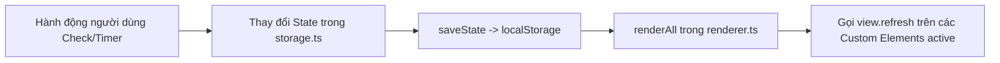

# ARCHITECTURE & REPLICATION GUIDE (HƯỚNG DẪN KIẾN TRÚC & TÁI TẠO REPO)

Tài liệu này tổng hợp toàn bộ kiến trúc kỹ thuật, công nghệ (Tech Stack), các thiết kế mẫu (Design Patterns), cấu trúc thư mục (Project Structure) và luồng xử lý dữ liệu của kho mã nguồn này. Dữ liệu này được thiết kế như một **bản thiết kế chi tiết (Master Blueprint)** giúp bất kỳ AI Agent hoặc lập trình viên nào có thể hiểu rõ, bảo trì, hoặc tái tạo (clone) lại cấu trúc ứng dụng cho bất kỳ dự án theo dõi lộ trình nào khác (ví dụ: *Web Dev Tracker, DevOps Journey, Data Engineering Roadmap...*).

---

## 1. Tổng quan Kiến trúc (Architectural Overview)

Ứng dụng là một **Single Page Application (SPA)** phục vụ việc theo dõi tiến độ học tập và thực hành (Roadmap & Sprint Journey Tracker).

- **Triết lý cốt lõi**: Lightweight, zero-framework runtime overhead, cực kỳ nhanh, mô-đun hóa bằng **Vanilla TypeScript** kết hợp **Custom Elements (Web Components - Light DOM)** và **Layered Vanilla CSS**.
- **Data-Driven Architecture**: 100% dữ liệu nội dung (Sprints, Modules, Tasks, Deliverables, Schedule, Resources, Tech Stack) được tách bạch hoàn toàn trong `src/data/planData.ts`. Giao diện UI chỉ đọc dữ liệu và render.
- **Client-side Persistence & Offline First**: Lưu trữ tiến độ người dùng, chủ đề giao diện và lịch sử phiên Pomodoro hoàn toàn tại `localStorage` với tính năng Export/Import dữ liệu định dạng JSON để sao lưu.
- **Integrated Pomodoro Engine**: Tích hợp bộ đếm giờ Pomodoro tương tác với âm thanh tổng hợp bằng Web Audio API và thông báo đẩy (Browser Notifications).

---

## 2. Tech Stack Chi Tiết

| Thành phần | Công nghệ sử dụng | Vai trò & Lý do lựa chọn |
| :--- | :--- | :--- |
| **Bundler & Dev Server** | **Vite 6.4+** | HMR tốc độ cực cao, hỗ trợ TypeScript out-of-the-box, build static assets gọn nhẹ. |
| **Ngôn ngữ** | **TypeScript 5.8+** | Đảm bảo Type Safety với Strict Mode (`tsc --noEmit`), tối ưu autocompletion cho data models. |
| **UI Framework** | **Vanilla Web Components (Light DOM)** | Kế thừa `HTMLElement` không dùng Shadow DOM để dễ dàng dùng chung CSS Tokens và Utility Classes toàn cục. |
| **Styling** | **Vanilla CSS (`@layer` + CSS Variables)** | Quản lý CSS bằng `@layer` tránh xung đột độ ưu tiên (Specificity Wars). Dùng CSS Custom Properties hỗ trợ Dark/Light mode. |
| **State Management** | **Centralized Store + Observer Re-render** | Quản lý state tập trung tại `src/state/storage.ts`. Tự động đồng bộ `localStorage` và trigger `renderAll()` cho các active views. |
| **Router** | **Hash Router (`#/route`)** | Client-side routing nhẹ dựa trên `window.onhashchange`, đồng bộ giữa URL hash, UI tab active và `localStorage`. |
| **Icons & Audio** | **SVG Dictionary + Web Audio API** | Render SVG icons tập trung tại `src/utils/icons.ts`. Phát âm thanh báo hiệu Pomodoro không cần file mp3 tĩnh nhờ `src/utils/audio.ts`. |
| **Deployment** | **GitHub Actions + GitHub Pages** | Workflow tự động build thư mục `dist/` và deploy lên GitHub Pages với `base: './'` trong `vite.config.ts`. |

---

## 3. Cấu trúc Thư mục Dự án (Project Directory Structure)

```text
├── .github/
│   └── workflows/          # GitHub Actions deployment workflow (static build & deploy to GitHub Pages)
├── docs/                   # Thư mục chứa toàn bộ tài liệu hướng dẫn & lộ trình (Markdown)
│   ├── architecture_guide.md   # File hướng dẫn kiến trúc & tái tạo repo (File này)
│   ├── online_learning_guide.md# Tài liệu hướng dẫn khóa học online miễn phí
│   ├── resources.md            # Danh sách tài nguyên học tập chi tiết
│   ├── schedule.md             # Chi tiết lịch trình Pomodoro mẫu
│   └── tech_stack.md           # Chi tiết các lớp công nghệ AI Engineer
├── index.html              # HTML Shell (Header, Navigation Tabs, 5 View Containers, Toast container)
├── package.json            # npm scripts (dev, build, preview, typecheck) & devDependencies (typescript, vite)
├── tsconfig.json           # Cấu hình TypeScript compiler options
├── vite.config.ts          # Cấu hình Vite bundler (khai báo base: './' cho relative assets path)
└── src/
    ├── actions/
    │   └── backup.ts       # Xử lý Export JSON sao lưu, Import JSON khôi phục và Reset tiến độ
    ├── constants.ts        # Định nghĩa hằng số STORAGE_KEY, THEME_KEY và ROUTE_IDS
    ├── data/
    │   └── planData.ts     # PURE DATA MODEL - Chứa toàn bộ nội dung lộ trình (META_DATA, SPRINT_MODULES, POMODORO_SCHEDULE, FREE_RESOURCES, TECH_STACK_LAYERS)
    ├── main.ts             # BOOTSTRAP - Khởi tạo app, theme, router, event listeners & render loop
    ├── progress.ts         # PURE DOMAIN LOGIC - Tính toán % hoàn thành (Deliverables 60% + Pomodoros 40%), giờ học, task tiếp theo
    ├── renderer.ts         # CENTRAL OBSERVER RENDERER - Đăng ký listener và kích hoạt renderAll() cho các Custom Element views
    ├── router.ts           # HASH ROUTER - Điều hướng hash (#/dashboard), chuyển tab và lưu tab active vào localStorage
    ├── state/
    │   └── storage.ts      # STATE STORE - Quản lý singleton AppState, load/save/reset state và lưu Pomodoro sessions
    ├── styles/             # HỆ THỐNG CSS LAYERED
    │   ├── main.css        # CSS entry point import các partials theo chỉ thị @layer (reset, base, components, views, utilities)
    │   ├── _tokens.css     # CSS Custom Properties (Colors, Dark/Light mode variables, Spacing, Typography)
    │   ├── _reset-base.css # CSS Reset & Base styling
    │   ├── _header.css     # Style cho Header & Brand bar
    │   ├── _tabs.css       # Style cho Navigation Tab bar
    │   ├── _main-layout.css# Style cho Main container layout
    │   ├── _views.css      # Style cho tất cả các Custom View Components (Dashboard, Roadmap, Schedule, Resources, Tech Stack)
    │   └── _responsive.css # Media queries cho Mobile/Tablet layout
    ├── toast.ts            # Utility hiển thị thông báo Toast nhanh trên màn hình
    ├── types/
    │   └── appState.ts     # TypeScript Interfaces (Task, ResourceItem, SprintModule, PomodoroSlot, DailyScheduleDay, TechStackLayer, AppState, PomodoroTimerSettings, PomodoroSessionLog)
    ├── utils/              # CÁC TIỆN ÍCH THUẦN
    │   ├── audio.ts        # Bộ tổng hợp âm thanh chuông báo bằng Web Audio API
    │   ├── icons.ts        # Từ điển chứa toàn bộ mã SVG Icons giao diện
    │   └── notification.ts # Utility gửi thông báo đẩy qua Web Notification API
    └── views/              # CUSTOM ELEMENTS (LIGHT DOM VIEWS)
        ├── roadmap-view-dashboard.ts  # <roadmap-view-dashboard> - View tổng quan tiến độ, stats, sprint hiện tại & next task
        ├── roadmap-view-roadmap.ts    # <roadmap-view-roadmap> - View danh sách 5 Sprints, deliverables checklist & resources
        ├── roadmap-view-schedule.ts   # <roadmap-view-schedule> - View đếm giờ Pomodoro tương tác & lịch trình học theo ngày/tuần
        ├── roadmap-view-resources.ts  # <roadmap-view-resources> - View danh mục tài nguyên miễn phí hỗ trợ lọc theo loại
        └── roadmap-view-techstack.ts  # <roadmap-view-techstack> - View sơ đồ các lớp công nghệ AI Engineer 2026
```

---

## 4. Core Design Patterns & Architecture Principles

### Pattern 1: Data-Driven UI Architecture (Kiến trúc Giao diện Dựa trên Dữ liệu)
- **Nguyên tắc**: Tách 100% dữ liệu nghiệp vụ ra khỏi giao diện UI. Dữ liệu tĩnh nằm tại `src/data/planData.ts`.
- **Primary Key Constraint**: Mỗi Task, Resource, hay Schedule slot **BẮT BUỘC** có một `id` duy nhất (ví dụ: `s1-t1`, `res-1`, `w1d1-p1`).
- **Cảnh báo quan trọng cho AI Agent**: Không bao giờ đổi tên hoặc thay đổi `id` của nhiệm vụ đã tạo trong `planData.ts` vì `id` chính là chìa khóa primary key lưu trữ trạng thái checked của người dùng trong `localStorage`.

### Pattern 2: Light-DOM Custom Elements Pattern
Các view sử dụng trực tiếp chuẩn **Custom Elements API** native của trình duyệt:
```typescript
export class RoadmapViewDashboard extends HTMLElement {
  connectedCallback(): void {
    this.refresh();
  }

  refresh(): void {
    // 1. Lấy dữ liệu mới nhất từ storage & progress engine
    const stats = calculateProgress();
    // 2. Tạo chuỗi HTML
    // 3. Cập nhật innerHTML
    // 4. Gắn event listeners cho các phần tử vừa tạo
  }
}
customElements.define("roadmap-view-dashboard", RoadmapViewDashboard);
```

### Pattern 3: Unidirectional Data Flow & Observer Re-render Loop
Ứng dụng duy trì luồng dữ liệu một chiều minh bạch:


### Pattern 4: Weighted Progress Calculation Engine (`src/progress.ts`)
Tiến độ phần trăm tổng thể được tính bằng công thức trọng số kết hợp:
\[
\text{Overall Percentage} = (\text{Deliverables Completion \%} \times 0.6) + (\text{Pomodoros Completion \%} \times 0.4)
\]
- Tự động xác định Sprint hiện tại (Sprint đầu tiên chưa hoàn thành 100%).
- Tìm kiếm nhiệm vụ kế tiếp (Next Task) chưa hoàn thành để gợi ý cho người dùng.

### Pattern 5: Modular Layered CSS System với CSS Custom Properties
CSS được cấu trúc bằng chỉ thị `@layer` để kiểm soát thứ tự ưu tiên tuyệt đối:
```css
@layer reset, base, components, views, utilities;

@import "./_tokens.css" layer(base);
@import "./_reset-base.css" layer(reset);
@import "./_header.css" layer(components);
@import "./_tabs.css" layer(components);
@import "./_main-layout.css" layer(components);
@import "./_views.css" layer(views);
@import "./_responsive.css" layer(utilities);
```
- Quản lý **Dark/Light Theme** thông qua thuộc tính `data-theme` trên thẻ `<html>`:
  ```css
  :root {
    --bg-primary: #0b0f19;
    --text-primary: #f8fafc;
  }
  [data-theme="light"] {
    --bg-primary: #ffffff;
    --text-primary: #0f172a;
  }
  ```

---

## 5. Blueprint Từng Bước Để AI Agent Clone/Tái Tạo Repo

Nếu bạn là một AI Agent được giao nhiệm vụ tạo mới một dự án tương tự cho một chủ đề khác, hãy thực hiện theo đúng 7 bước sau:

### Bước 1: Khởi tạo Repo & Cấu hình Build Environment
1. Khởi tạo `package.json` với các scripts:
   - `"dev": "vite"`
   - `"build": "tsc --noEmit && vite build"`
   - `"preview": "vite preview"`
   - `"typecheck": "tsc --noEmit"`
2. Cài đặt `devDependencies`: `typescript` và `vite`.
3. Tạo file `vite.config.ts` bắt buộc khai báo `base: './'` để static assets hoạt động đúng khi deploy trên GitHub Pages.

### Bước 2: Xây dựng Core Types & State Store
1. Tạo `src/types/appState.ts` định nghĩa interfaces cho data models và `AppState` (`checked`, `resourceFlags`, `activeTab`, `theme`, `pomodoroSettings`, `pomodoroSessions`).
2. Tạo `src/constants.ts` chứa `STORAGE_KEY`, `THEME_KEY`, `ROUTE_IDS`.
3. Tạo `src/state/storage.ts` quản lý singleton `AppState`, cung cấp `loadState()`, `saveState()`, `setThemeState()`, `savePomodoroSession()`.

### Bước 3: Định nghĩa Data Model Mới (`src/data/planData.ts`)
1. Thiết kế dữ liệu theo cấu trúc chuẩn: `META_DATA`, `SPRINT_MODULES`, `POMODORO_SCHEDULE`, `FREE_RESOURCES`, `TECH_STACK_LAYERS`.
2. Gán ID tĩnh duy nhất cho tất cả các nhiệm vụ, tài nguyên và slot đếm giờ.

### Bước 4: Xây dựng Domain Progress Engine (`src/progress.ts`)
1. Viết pure function `calculateProgress()` dựa trên `state.checked`, `state.pomodoroSessions` và `PLAN_DATA`.
2. Tính toán tổng thể %, % từng Sprint, tổng số giờ hoàn thành/còn lại, xác định Sprint hiện tại và gợi ý Task tiếp theo.

### Bước 5: Cài đặt Router & Central Renderer
1. Create `src/renderer.ts`: Cung cấp callback pattern `registerRenderListener()` và `renderAll()`.
2. Create `src/router.ts`: Đọc/Ghi hash location (`window.location.hash`), chuyển đổi tab UI active và lưu vết tab cuối vào `localStorage`.

### Bước 6: Xây dựng Custom Element Views (`src/views/`)
1. Mỗi Tab tạo một Custom Element kế thừa `HTMLElement` (ví dụ `roadmap-view-dashboard.ts`, `roadmap-view-roadmap.ts`).
2. Viết phương thức `refresh()` thực hiện re-render HTML và gán event listeners.
3. Đăng ký Web Component: `customElements.define("roadmap-view-dashboard", RoadmapViewDashboard)`.

### Bước 7: Hoàn thiện HTML Shell, Design System & Bootstrap
1. Cấu hình `index.html` chứa `<header>`, thanh `<nav class="nav-tabs">`, các container view `<roadmap-view-*>` và script bootstrap.
2. Xây dựng bộ CSS Token (`_tokens.css`) và các CSS Layers (`main.css`).
3. Khai báo `src/main.ts` kết nối tất cả các thành phần: load state ➔ apply theme ➔ gán event listener ➔ init router ➔ thực thi `renderAll()`.

---

## 6. Checklist Kiểm Thử Tiến Độ Tái Tạo (Verification Checklist)

- [ ] `npm run typecheck` chạy thành công không có lỗi TypeScript.
- [ ] `npm run build` tạo thành công thư mục `dist/` với đường dẫn tương đối (`./assets/...`).
- [ ] Khi tích/bỏ tích checkbox công việc, phần trăm tiến độ trên Dashboard và Navigation Badge được cập nhật tức thì.
- [ ] Khi F5 (Reload trang), toàn bộ trạng thái checked, cài đặt theme và tab active được giữ nguyên.
- [ ] Bộ đếm giờ Pomodoro chạy mượt mà, phát âm thanh báo khi kết thúc và lưu lịch sử phiên.
- [ ] Tính năng Export JSON tải về file sao lưu hợp lệ và Import JSON khôi phục chính xác trạng thái.
