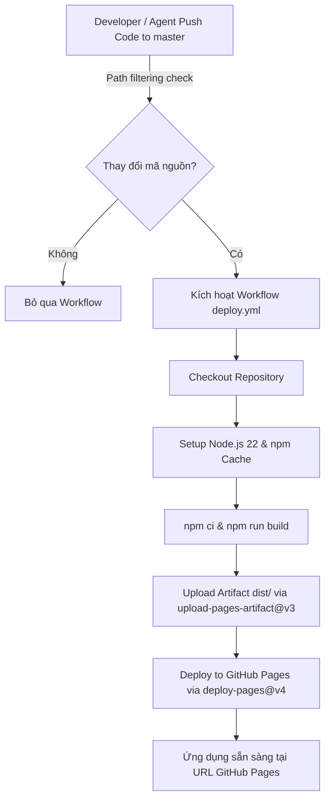

# HƯỚNG DẪN IMPLEMENT GITHUB PAGES QUA GITHUB ACTIONS (GITHUB PAGES DEPLOYMENT GUIDE)

Tài liệu này hướng dẫn chi tiết quy trình cấu hình và triển khai tự động (CI/CD) ứng dụng Web Single Page Application (SPA) phát triển bằng Vite & TypeScript lên **GitHub Pages** thông qua **GitHub Actions**. Đây là tài liệu chuẩn giúp các AI Agent hoặc Lập trình viên thiết lập tự động hóa xây dựng (build) và phát hành ứng dụng không cần can thiệp thủ công.

---

## 1. Tổng quan Kiến trúc Triển khai (Deployment Architecture)

Quy trình tự động hóa triển khai ứng dụng lên GitHub Pages sử dụng kiến trúc GitHub Actions như sau:



---

## 2. Các Yêu cầu Tiền đề (Prerequisites)

### 2.1 Cấu hình GitHub Repository Settings
Trước khi workflow GitHub Actions chạy lần đầu, bạn cần bật tính năng GitHub Pages trong Settings của Repository:
1. Truy cập Repository trên GitHub ➔ **Settings** ➔ **Pages** (thuộc mục *Code and automation*).
2. Tại phần **Build and deployment** ➔ **Source**: Chọn **GitHub Actions** (thay vì *Deploy from a branch*).

---

## 3. Cấu hình Vite (`vite.config.ts`)

Để ứng dụng SPA phục vụ tốt trên đường dẫn con của GitHub Pages (ví dụ: `https://<username>.github.io/<repo-name>/`), các đường dẫn asset tĩnh trong file `index.html` và file JavaScript phải là **đường dẫn tương đối (`./`)**.

File `vite.config.ts` bắt buộc được cấu hình như sau:

```typescript
import { defineConfig } from 'vite';

export default defineConfig({
  base: './', // BẮT BUỘC: Đường dẫn tương đối giúp static assets load đúng trên GitHub Pages
  build: {
    outDir: 'dist',
    sourcemap: true,
  },
});
```

> [!IMPORTANT]
> Nếu không đặt `base: './'`, các file CSS/JS sẽ được import theo dạng gốc tuyệt đối (`/assets/...`) gây ra lỗi **404 Not Found** và hiển thị trang trắng khi truy cập trang GitHub Pages.

---

## 4. Định nghĩa Workflow GitHub Actions (`.github/workflows/deploy.yml`)

Tạo hoặc cập nhật file `.github/workflows/deploy.yml` với nội dung chuẩn dưới đây:

```yaml
name: Deploy to GitHub Pages

on:
  push:
    branches: [master]
    paths:
      - 'src/**'
      - 'public/**'
      - 'index.html'
      - 'package.json'
      - 'package-lock.json'
      - 'vite.config.ts'
      - 'tsconfig.json'
      - '.github/workflows/deploy.yml'
  workflow_dispatch:

permissions:
  contents: read
  pages: write
  id-token: write

concurrency:
  group: pages
  cancel-in-progress: false

jobs:
  deploy:
    environment:
      name: github-pages
      url: ${{ steps.deployment.outputs.page_url }}
    runs-on: ubuntu-latest
    steps:
      - name: Checkout
        uses: actions/checkout@v4

      - name: Setup Node
        uses: actions/setup-node@v4
        with:
          node-version: "22"
          cache: npm

      - name: Install and build
        run: |
          npm ci
          npm run build

      - name: Setup Pages
        uses: actions/configure-pages@v5

      - name: Upload artifact
        uses: actions/upload-pages-artifact@v3
        with:
          path: dist

      - name: Deploy to GitHub Pages
        id: deployment
        uses: actions/deploy-pages@v4
```

---

## 5. Phân tích Chi tiết Các Thành phần Workflow

### 5.1 Trigger (`on`) & Path Filtering
- `push.branches: [master]`: Workflow chỉ kích hoạt khi có commit đẩy lên nhánh `master` (hoặc `main` tùy theo thiết lập của repo).
- `paths`: Chỉ kích hoạt build khi các file tác động tới giao diện và logic ứng dụng bị thay đổi (giúp tiết kiệm thời gian chạy Action runner khi sửa các file docs không liên quan).
- `workflow_dispatch`: Cho phép kích hoạt build & deploy thủ công từ giao diện tab **Actions** trên GitHub.

### 5.2 Permissions (Quyền hạn)
- `pages: write`: Quyền ghi để đăng tải gói artifact lên hạ tầng GitHub Pages.
- `id-token: write`: Quyền lấy OpenID Connect (OIDC) token để xác thực an toàn giữa Action runner và dịch vụ GitHub Pages mà không cần dùng Personal Access Token (PAT).
- `contents: read`: Quyền đọc mã nguồn trong repository.

### 5.3 Concurrency Control (Kiểm soát Đồng thời)
- `group: pages`: Đảm bảo chỉ có một tiến trình deploy GitHub Pages chạy tại một thời điểm.
- `cancel-in-progress: false`: Đảm bảo deployment đang thực hiện không bị hủy giữa chừng nếu có push mới, tránh làm hỏng trạng thái trang web.

### 5.4 Các bước Thực thi (Job Steps)
1. **`actions/checkout@v4`**: Tải mã nguồn repo về môi trường runner.
2. **`actions/setup-node@v4`**: Khởi tạo môi trường Node.js v22 và bật tính năng cache `npm` để tối ưu thời gian cài gói dependencies.
3. **`npm ci && npm run build`**:
   - `npm ci`: Cài đặt dependencies chính xác theo `package-lock.json`.
   - `npm run build`: Chạy `tsc --noEmit && vite build` để biên dịch ứng dụng ra thư mục `dist/`.
4. **`actions/configure-pages@v5`**: Khởi tạo cấu hình GitHub Pages cho runner.
5. **`actions/upload-pages-artifact@v3`**: Nén và tải thư mục `dist/` lên làm deployment artifact.
6. **`actions/deploy-pages@v4`**: Thực thi deploy artifact lên hạ tầng phục vụ của GitHub Pages và trả về URL trang web công khai.

---

## 6. Các Bước Implement Từng Bước Cho AI Agent / Developer

Khởi tạo tính năng tự động deploy cho repo mới theo đúng 4 bước:

1. **Bước 1: Kiểm tra `vite.config.ts`**
   Đảm bảo thuộc tính `base: './'` và `outDir: 'dist'` đã có trong `vite.config.ts`.
2. **Bước 2: Đảm bảo Scripts trong `package.json`**
   Đảm bảo `package.json` có script:
   ```json
   "scripts": {
     "build": "tsc --noEmit && vite build"
   }
   ```
3. **Bước 3: Tạo File Workflow**
   Tạo file `.github/workflows/deploy.yml` với đúng cấu hình ở Mục 4.
4. **Bước 4: Thiết lập Repo Settings & Test Deploy**
   - Đẩy code lên GitHub: `git add . && git commit -m "feat: add github pages deployment workflow" && git push`
   - Kiểm tra **Settings ➔ Pages ➔ Source: GitHub Actions**.
   - Mở tab **Actions** trên GitHub để theo dõi quá trình build và lấy URL sản phẩm sau khi deploy thành công.

---

## 7. Xử lý Lỗi Thường Gặp (Troubleshooting Guide)

| Hiện tượng / Lỗi | Nguyên nhân | Cách khắc phục |
| :--- | :--- | :--- |
| Trang bị trắng xóa (Blank White Screen) hoặc lỗi 404 assets | Thiếu `base: './'` trong `vite.config.ts`. | Thêm `base: './'` vào `vite.config.ts` và push lại code. |
| Action báo lỗi `Permission denied` hoặc `403 Forbidden` | Thiếu khai báo `permissions` trong `deploy.yml` hoặc Repo chưa bật GitHub Actions Pages. | Thêm `permissions: pages: write, id-token: write` và kiểm tra Settings ➔ Pages ➔ Source. |
| Build thất bại ở bước `npm run build` | Mã TypeScript có lỗi type error. | Chạy `npm run typecheck` dưới local để phát hiện và sửa toàn bộ lỗi trước khi push. |
| Action không tự động kích hoạt khi push code | Tên nhánh đẩy lên không khớp (`main` vs `master`) hoặc thay đổi thuộc các file ngoài `paths`. | Kiểm tra tên nhánh chính của repo (`branches: [master]` hoặc `[main]`) và kiểm tra danh sách `paths`. |
