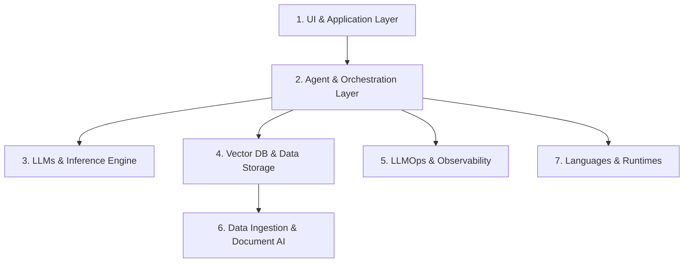

# Báo Cáo Chuyên Sâu: AI Application Tech Stack

Báo cáo tổng hợp bức tranh công nghệ (Tech Stack) phổ biến và chuẩn mực nhất để phát triển ứng dụng AI (AI Application) từ giai đoạn thử nghiệm (PoC/MVP) đến môi trường sản xuất (Production), kèm theo số liệu dẫn chứng và phân tích kiến trúc chi tiết.

---

## 🏗️ Tổng Quan Kiến Trúc AI Application Stack

Hệ sinh thái công nghệ phát triển ứng dụng AI hiện nay được chia thành 7 tầng chuyên biệt:

---

## 1. Ngôn Ngữ Lập Trình & Runtime (Languages & Runtimes)

| Ngôn ngữ | Vai trò chính | Tỷ lệ sử dụng / Xu hướng |
| :--- | :--- | :--- |
| **Python** | Backend logic, AI models integration, RAG pipelines, Data Engineering, FastAPI/Pydantic services. | **~58%** (*Stack Overflow Developer Survey*), là ngôn ngữ chủ lực thống trị mảng AI/ML. |
| **TypeScript / JS** | Full-stack Web AI, Streaming Response UI, Interactive Widgets, Edge Functions. | **~44%** (*Stack Overflow Survey*), chuẩn mực xây dựng UI với React/Next.js. |
| **Rust & Go** | High-performance inference cores, Vector DBs (Qdrant), low-latency sidecars, Local CLI runners (Ollama). | Đang tăng trưởng mạnh ở tầng hạ tầng xử lý latency thấp. |

---

## 2. Giao Diện Người Dùng & Web Frameworks (UI & Frontend Layer)

* **Next.js (React) + Vercel AI SDK (Tiêu chuẩn Web App Production):**
  * Hỗ trợ HTTP Streaming Response (cập nhật UI dạng stream từng token).
  * Hỗ trợ Generative UI, Server Components và Server Actions.
  * Bộ UI phổ biến: **TailwindCSS** kết hợp **Shadcn/ui**.
* **Streamlit & Gradio (Tiêu chuẩn Demo & Data Apps):**
  * **Streamlit:** Phổ biến trong nội bộ doanh nghiệp để tạo dashboard dữ liệu và công cụ AI bằng Python.
  * **Gradio:** Chuẩn mực của Hugging Face ecosystem để chia sẻ demo tương tác công khai.

---

## 3. Khung Điều Phối & AI Agent (Orchestration & Agent Frameworks)

* **LangChain & LangGraph:**
  * **LangChain:** Thư viện phổ biến cho RAG cơ bản và chuỗi lệnh LLM (LLM chains).
  * **LangGraph:** Tiêu chuẩn cho **Stateful Production Agents** — hỗ trợ luồng thực thi lặp (cyclic graphs), quản lý trạng thái (state persistence), human-in-the-loop và time-travel debugging.
* **CrewAI:** Lựa chọn hàng đầu cho việc xây dựng mẫu nhanh (prototype) hệ thống Multi-Agent phân vai.
* **LlamaIndex:** Khung thư viện chuyên sâu cho Data Indexing, RAG phức tạp và truy vấn dữ liệu doanh nghiệp.
* **DSPy (Stanford):** Chuyển dịch từ việc viết prompt thủ công sang tối ưu hóa prompt bằng thuật toán (programmatic prompt optimization).

> 📌 **Số liệu dẫn chứng:** Khoảng **57% doanh nghiệp** đã đưa AI Agents vào môi trường sản xuất (*Enterprise AI Adoption Index*), trong đó LangChain/LangGraph chiếm phần lớn thị phần khung điều phối.

---

## 4. Mô Hình AI & Engine Triển Khai (LLMs & Inference Engines)

### 4.1 Cloud LLM APIs (API Thương Mại)
* **OpenAI (GPT-4o, o1, o3):** Dẫn đầu về suy luận logic phức tạp (reasoning) và khả năng xử lý đa phương thức.
* **Anthropic (Claude 3.5 Sonnet / 3.7):** Lựa chọn số 1 của lập trình viên về khả năng lập trình (coding), đọc tài liệu dài và độ tuân thủ chỉ thị.
* **Google (Gemini 1.5 Pro / 2.0 Flash):** Nổi bật với cửa sổ ngữ cảnh siêu lớn (1M–2M tokens) và chi phí xử lý tối ưu.

### 4.2 Open-Source Models & Local Serving
* **Mô hình mã nguồn mở hàng đầu:** Meta Llama 3.3, DeepSeek-R1 / V3, Mistral / Codestral, Qwen 2.5.
* **vLLM (Standard for Production In-House Serving):**
  * Sử dụng thuật toán **PagedAttention** tối ưu hóa bộ nhớ GPU.
  * **Số liệu dẫn chứng:** **vLLM cung cấp thông lượng (throughput) gấp ~6 lần so với Ollama** trong kịch bản phục vụ nhiều người dùng đồng thời.
* **Ollama (Standard for Local & Development):**
  * Đơn giản, cài đặt nhanh trên máy cá nhân, phục vụ thử nghiệm local và môi trường offline.

---

## 5. Cơ Sở Dữ Liệu Vector & Hybrid Search (Vector DB & RAG Storage)

Thị trường đang dịch chuyển mạnh theo xu hướng **"Vector as a Feature"** (Tích hợp Vector vào CSDL quan hệ).

| Công nghệ | Phân loại | Đặc điểm & Trường hợp sử dụng |
| :--- | :--- | :--- |
| **pgvector (PostgreSQL)** | *Extension cho DB Quan hệ* | **Lựa chọn mặc định (Default Choice)** cho các ứng dụng RAG vừa và nhỏ (< 50-100M vectors). Giúp tận dụng hạ tầng sẵn có mà không phát sinh chi phí vận hành. |
| **Pinecone** | *Managed Vector DB (SaaS)* | Zero-Ops, tối ưu hoàn toàn trên Cloud cho doanh nghiệp lớn. |
| **Qdrant** | *Dedicated Vector DB (Rust)* | Tốc độ cao, chi phí tối ưu, hỗ trợ Payload Filtering và Hybrid Search mạnh mẽ. |
| **Milvus / Zilliz** | *Enterprise Distributed DB* | Phục vụ quy mô siêu lớn (hàng tỷ vector) với khả năng mở rộng hàng ngang. |
| **ChromaDB** | *Embedded DB* | Phổ biến nhất khi thử nghiệm Local / MVP nhờ tích hợp dễ dàng với Python. |

> 📌 **Số liệu dẫn chứng:** Quy mô thị trường Vector DB đạt khoảng **2.5 – 3 tỷ USD** (tốc độ tăng trưởng CAGR ~23%). `pgvector` liên tục bứt phá nhờ tiện ích giảm thiểu rủi ro vận hành (operational complexity).

---

## 6. LLMOps, Giám Sát & Đánh Giá (Observability & Evaluation)

* **Observability & Tracing (Theo vết lệnh & Chi phí):**
  * **Langfuse (Open-source leader):** Theo dõi chi tiết prompt, latency, token cost, và flow của Agent.
  * **LangSmith / Helicone / Arize Phoenix:** Công cụ debugging chuyên sâu cho LLM chains.
* **Evaluation & Benchmark (Đánh giá chất lượng RAG):**
  * **Ragas & DeepEval:** Khung đo lường tự động chỉ số Faithfulness, Answer Relevance, Context Recall.
  * **Promptfoo:** Công cụ CI/CD testing cho prompt và kiểm thử bảo mật (Prompt Injection).
* **Fine-Tuning Frameworks:**
  * **Unsloth:** Tăng tốc độ Fine-tuning LLM gấp **2x–5x** và giảm **80%** VRAM GPU.

---

## 7. Xử Lý Dữ Liệu Đầu Vào (Data Ingestion & Document AI)

* **LlamaParse (by LlamaIndex):** Tối ưu hóa đọc và trích xuất bảng biểu từ PDF phức tạp thành Markdown cho LLM.
* **Unstructured.io / Docling (IBM):** Thư viện mã nguồn mở mạnh mẽ để parse nhiều định dạng file (Docx, PPTX, HTML, PDF scanned).

---

## 💡 Gợi Ý Kiến Trúc Thực Tế (Reference Architectures)

### 🔵 Architecture A: Modern Full-Stack AI Web Application (SaaS/Web Product)
* **Frontend/Fullstack:** Next.js (TypeScript) + TailwindCSS + Shadcn/ui + Vercel AI SDK.
* **Backend Services:** FastAPI (Python).
* **Agent / RAG Framework:** LangGraph / LlamaIndex.
* **LLM APIs:** Anthropic Claude 3.5 Sonnet / OpenAI GPT-4o (Model chính) + DeepSeek-R1 (Model suy luận).
* **Database:** PostgreSQL với `pgvector`.
* **Observability:** Langfuse (Self-hosted hoặc Cloud SaaS).

### 🟢 Architecture B: Enterprise Private AI Stack (Bảo Mật Dữ Liệu Nội Bộ)
* **Serving Layer:** vLLM Cluster (Chạy trên On-Premise GPU / Private Cloud).
* **Open Source Model:** Llama 3.3 70B / DeepSeek-V3.
* **Vector DB:** Qdrant hoặc Milvus.
* **Orchestration:** LangGraph + Python.
* **Document Parsing:** Docling / Unstructured.
* **Evaluation & Guardrails:** NeMo Guardrails + Ragas.
