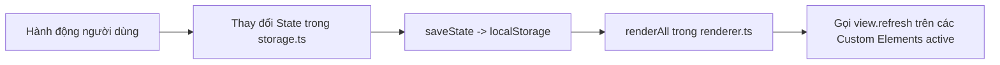

# REPLICATION & ARCHITECTURE GUIDE (HƯỚNG DẪN TÁI TẠO KIẾN TRÚC REPO)

Tài liệu này tổng hợp toàn bộ kiến trúc kỹ thuật, công nghệ (Tech Stack), thiết kế mẫu (Design Patterns), và cấu trúc thư mục (Project Structure) của kho mã nguồn này. Dữ liệu này được thiết kế như một **bản thiết kế chi tiết (Blueprint / Master Prompt)** cho một AI agent khác tái tạo hoặc clone lại cấu trúc ứng dụng cho bất kỳ chủ đề/dự án theo dõi lộ trình nào khác (ví dụ: *Web Dev Tracker, DevOps Journey, Data Engineering Roadmap...*).

---

## 1. Tổng quan Kiến trúc (Architectural Overview)

Ứng dụng là một **Single Page Application (SPA)** phục vụ việc theo dõi tiến độ (Journey Tracker / Dashboard).

- **Triết lý cốt lõi**: Lightweight, zero-framework runtime overhead, cực kỳ nhanh, mô-đun hóa bằng **Vanilla TypeScript** kết hợp **Custom Elements (Web Components)** và **Layered Vanilla CSS**.
- **Data-Driven Architecture**: 100% dữ liệu nội dung (giai đoạn, tuần học, nhiệm vụ, rủi ro, chi phí, tài nguyên) được tách bạch hoàn toàn trong `src/data/planData.ts`. Giao diện UI chỉ thực hiện đọc dữ liệu và render.
- **Client-side Persistence**: Lưu trữ tiến độ người dùng hoàn toàn ở Local Storage với cơ chế Export/Import dữ liệu định dạng JSON.

---

## 2. Tech Stack Chi Tiết

| Thành phần | Công nghệ sử dụng | Vai trò & Lý do lựa chọn |
| :--- | :--- | :--- |
| **Bundler & Dev Server** | **Vite 6+** | HMR tốc độ cao, hỗ trợ TypeScript out-of-the-box, build ra static assets gọn nhẹ. |
| **Ngôn ngữ** | **TypeScript 5.8+** | Đảm bảo Type Safety với Strict Mode (`tsc --noEmit`), tối ưu hóa autocompletion cho cấu trúc dữ liệu lộ trình. |
| **UI Framework** | **Vanilla Web Components (Light DOM)** | Kế thừa `HTMLElement` không dùng Shadow DOM để dễ dàng dùng chung CSS Tokens và Utility Classes toàn cục. |
| **Styling** | **Vanilla CSS (`@layer` + CSS Variables)** | Quản lý CSS bằng `@layer` tránh xung đột độ ưu tiên (Specificity Wars). Dùng CSS Custom Properties hỗ trợ Dark/Light mode linh hoạt. |
| **State Management** | **Centralized Store + Pub-Sub Re-render** | Quản lý state tập trung tại `src/state/storage.ts`. Tự động đồng bộ `localStorage` và trigger re-render toàn bộ views. |
| **Router** | **Hash Router (`#/route`)** | Client-side routing nhẹ dựa trên `window.onhashchange`, đồng bộ giữa URL hash, UI tab active và `localStorage`. |
| **Deployment** | **GitHub Actions + GitHub Pages** | Workflow tự động build thư mục `dist/` và deploy lên GitHub Pages với `base: './'` trong `vite.config.ts`. |

---

## 3. Cấu trúc Thư mục Dự án (Project Directory Structure)

```text
├── .github/
│   └── workflows/          # GitHub Actions deployment script (static build & deploy to GitHub Pages)
├── index.html              # HTML Shell (Header, Navigation Tabs, Custom View Containers, Toast container)
├── package.json            # npm scripts (dev, build, preview, typecheck) & minimal devDependencies
├── tsconfig.json           # Cấu hình TypeScript compiler options
├── vite.config.ts          # Cấu hình Vite bundler (sử dụng base: './' cho relative assets path)
├── CLAUDE.md               # Hướng dẫn nhanh cho AI Coding Assistants
├── REPLICATION_GUIDE.md    # File hướng dẫn tái tạo kiến trúc (File này)
└── src/
    ├── actions/            # Các hàm xử lý hành động người dùng (Export/Import backup, Toggle flags)
    │   ├── backup.ts       # Xử lý Export, Import JSON file và Reset progress
    │   └── resourceFlags.ts# Đánh dấu trạng thái tài nguyên (đã mua, verified...)
    ├── constants.ts        # Định nghĩa hằng số hệ thống, Route IDs và LocalStorage Keys
    ├── data/
    │   └── planData.ts     # PURE DATA MODEL - Chứa toàn bộ nội dung lộ trình (Phases, Tasks, Costs, Risks...)
    ├── main.ts             # BOOTSTRAP - Khởi tạo ứng dụng, theme, router, event binding & render loop
    ├── progress.ts         # PURE DOMAIN LOGIC - Tính toán % hoàn thành, thời gian dự kiến, trạng thái phase
    ├── renderer.ts         # PUB-SUB RENDERER - Đăng ký và kích hoạt renderAll() cho các views
    ├── router.ts           # HASH ROUTER - Điều hướng hash (#/dashboard), chuyển tab và lưu tab active
    ├── state/
    │   └── storage.ts      # STATE STORE - Định nghĩa AppState, load/save/normalize với localStorage
    ├── styles/             # HỆ THỐNG CSS LAYERED
    │   ├── main.css        # Import các CSS partials theo thứ tự @layer
    │   ├── _tokens.css     # CSS Custom Properties (Colors, Spacing, Typography, Dark/Light mode)
    │   ├── _reset-base.css # CSS Reset & Base Typography styles
    │   ├── _header.css     # Style cho Header & Brand bar
    │   ├── _tabs.css       # Style cho Navigation Tab bar
    │   ├── _main-layout.css# Style cho main container & layout grid
    │   ├── _views-dashboard-through-toast.css # Component styles cho Dashboard, Phases, Job, Costs...
    │   ├── _resources.css  # Component styles cho tab Resources
    │   └── _responsive.css # Media queries cho Mobile/Tablet layout
    ├── toast.ts            # Utility hiển thị thông báo Toast nhanh
    ├── types/
    │   └── appState.ts     # TypeScript Interfaces định nghĩa kiểu dữ liệu cho User State
    ├── utils/              # Các hàm tiện ích thuần (HTML escaping, Format ngày tháng)
    │   ├── format.ts
    │   └── html.ts
    └── views/              # CUSTOM ELEMENTS (LIGHT DOM VIEWS)
        ├── ml-view-costs.ts
        ├── ml-view-dashboard.ts
        ├── ml-view-job.ts
        ├── ml-view-phases.ts
        ├── ml-view-resources.ts
        ├── ml-view-risks.ts
        └── ml-view-routine.ts
```

---

## 4. Core Design Patterns & Architecture Principles

### Pattern 1: Data-Driven UI Architecture (Kiến trúc Giao diện Dựa trên Dữ liệu)
- **Nguyên tắc**: Tách 100% dữ liệu nghiệp vụ ra khỏi giao diện UI. Dữ liệu tĩnh nằm tại `src/data/planData.ts`.
- **Primary Key Constraint**: Mỗi Task, Phase hay Checkpoint **BẮT BUỘC** có một `id` duy nhất (ví dụ: `p1-w1-t1`).
- **Cảnh báo quan trọng cho AI Agent**: Không bao giờ đổi tên hoặc thay đổi `id` của nhiệm vụ đã tạo trong `planData.ts` vì `id` chính là chìa khóa primary key lưu trữ trạng thái checked của người dùng trong `localStorage`.

### Pattern 2: Light-DOM Web Components Pattern
Các view không dùng framework phức tạp (React/Vue/Svelte) mà sử dụng trực tiếp chuẩn **Custom Elements API**:
```typescript
export class MlViewDashboard extends HTMLElement {
  refresh(): void {
    // 1. Lấy dữ liệu mới nhất từ state & progress calculation helpers
    // 2. Tạo HTML string mẫu
    // 3. Cập nhật innerHTML
    // 4. Gắn các event listener cho các phần tử UI vừa tạo
  }
}
customElements.define("ml-view-dashboard", MlViewDashboard);
```

### Pattern 3: Unidirectional Data Flow & Observer Re-render Loop
Ứng dụng duy trì một luồng dữ liệu một chiều đơn giản nhưng hiệu quả:


### Pattern 4: Modular Layered CSS System với CSS Custom Properties
CSS được cấu trúc bằng chỉ thị `@layer` để kiểm soát thứ tự ưu tiên:
```css
@layer reset, base, components, utilities, views;

@import "./_tokens.css" layer(base);
@import "./_reset-base.css" layer(reset);
@import "./_header.css" layer(components);
@import "./_tabs.css" layer(components);
@import "./_main-layout.css" layer(components);
@import "./_views-dashboard-through-toast.css" layer(views);
@import "./_resources.css" layer(views);
@import "./_responsive.css" layer(utilities);
```
- Quản lý **Dark/Light Theme** thông qua thuộc tính `data-theme` trên thẻ `<html>`:
  ```css
  :root {
    --bg-primary: #f8fafc;
    --text-primary: #0f172a;
  }
  [data-theme="dark"] {
    --bg-primary: #0f172a;
    --text-primary: #f8fafc;
  }
  ```

---

## 5. Blueprint Từng Bước Để AI Agent Clone/Tái Tạo Repo

Nếu bạn là một AI Agent được giao nhiệm vụ tạo mới một dự án tương tự cho một chủ đề khác, hãy thực hiện theo đúng 7 bước sau:

### Bước 1: Khởi tạo Repo & Cấu hình Build Environment
1. Khởi tạo `package.json` với các script:
   - `"dev": "vite"`
   - `"build": "tsc --noEmit && vite build"`
   - `"preview": "vite preview"`
   - `"typecheck": "tsc --noEmit"`
2. Đội ngũ phụ thuộc (`devDependencies`): `typescript` và `vite`.
3. Tạo file `vite.config.ts` bắt buộc khai báo `base: './'` để tài nguyên tĩnh chạy đúng khi deploy GitHub Pages subpath.

### Bước 2: Xây dựng Core Types & State Store
1. Tạo `src/types/appState.ts` định nghĩa giao diện lưu trữ trạng thái người dùng (ví dụ: `checked: Record<string, boolean>`, `notes: Record<string, string>`, ngày bắt đầu, v.v.).
2. Tạo `src/constants.ts` chứa `STORAGE_KEY`, `THEME_KEY`, `ROUTE_IDS`.
3. Tạo `src/state/storage.ts` quản lý biến `state` đơn (singleton), cung cấp các hàm `loadState()`, `saveState()`, `normalizeState()`.

### Bước 3: Định nghĩa Data Model Mới (`src/data/planData.ts`)
1. Thiết kế dữ liệu theo cấu trúc chuẩn: `meta`, `phases`, `successCriteria`, `costs`, `risks`, `routine`, `jobHunt`.
2. Gán ID tĩnh duy nhất cho tất cả các phần tử (nhiệm vụ, tuần học, chi phí).

### Bước 4: Xây dựng Domain Progress Calculation Engine (`src/progress.ts`)
1. Viết các pure functions tính toán tiến độ dựa trên `state.checked` và `PLAN_DATA`.
2. Các tính toán chính: `% hoàn thành tổng thể`, `% của từng Phase`, `số tuần cần thiết dựa trên số giờ học/ngày`, `ngày hoàn thành dự kiến`.

### Bước 5: Cài đặt Router & Central Renderer
1. Create `src/renderer.ts`: Cung cấp callback pattern `setRenderAll()` và `renderAll()`.
2. Create `src/router.ts`: Đọc/Ghi hash location (`window.location.hash`), đồng bộ tab UI active và lưu vết tab cuối vào `localStorage`.

### Bước 6: Xây dựng Custom Element Views
1. Mỗi Tab tạo một file tương ứng trong `src/views/` (ví dụ `view-dashboard.ts`, `view-phases.ts`).
2. Viết class kế thừa `HTMLElement` chứa hàm `refresh()`.
3. Đăng ký Web Component: `customElements.define("app-view-dashboard", AppViewDashboard)`.

### Bước 7: Hoàn thiện HTML Shell, Design System & Bootstrap
1. Cấu hình `index.html` chứa thẻ `<header>`, thanh `<nav class="tabs">`, và các thẻ View `<app-view-* class="view">`.
2. Xây dựng bộ CSS Token (`_tokens.css`) và các CSS Layers (`main.css`).
3. Khai báo file `src/main.ts` kết nối tất cả các thành phần: load state ➔ apply theme ➔ gán event listener ➔ init router ➔ thực thi `renderAll()`.

---

## 6. Checklist Kiểm Thử Tiến Độ Tái Tạo (Verification Checklist)

- [ ] `npm run typecheck` chạy không có lỗi TypeScript nào.
- [ ] `npm run build` tạo thành công thư mục `dist/` với các đường dẫn tương đối (`./assets/...`).
- [ ] Khi tích/bỏ tích checkbox trên UI, tiến độ `%` trên Dashboard và thanh Progress Bar lập tức cập nhật.
- [ ] Khi F5 (Reload trang), toàn bộ trạng thái checked và tab đang đứng được giữ nguyên.
- [ ] Nút Toggle Light/Dark Theme hoạt động mượt mà và lưu lại tùy chọn.
- [ ] Tính năng Export JSON tải về file dữ liệu hợp lệ và Import JSON khôi phục đúng trạng thái.
